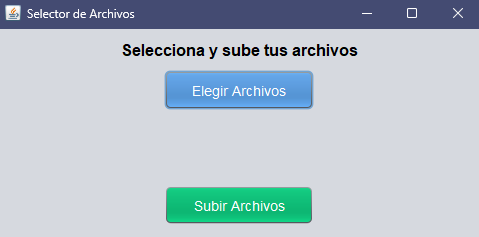

# Chroma_API_VIEW
Ventana básica para subida de archivo al endpoint de FastAPI existente dentro del proyecto de python.
# 📁 FileUploaderApp

Una aplicación de escritorio en Java Swing que permite seleccionar múltiples archivos desde el sistema y subirlos a una API a través de HTTP.

---

## 🚀 Características

- GUI moderna con Java Swing y Nimbus Look & Feel
- Selección de múltiples archivos (`JFileChooser`)
- Envío de archivos a una API REST (`multipart/form-data`)
- Arquitectura limpia basada en MVC (Modelo - Vista - Controlador)
- Exportable como `.jar` ejecutable

---

## 🖼️ Captura de pantalla

> 

---

## 🛠️ Requisitos

- Java JDK 8 o superior
- (Opcional) Eclipse o IntelliJ IDEA
- API receptora corriendo en `http://127.0.0.1:8000/process-docs/` (por defecto)

---

## 📦 Compilación

### 👉 Desde Eclipse

1. Clic derecho en el proyecto → `Export`
2. Selecciona `Runnable JAR file`
3. Elige clase principal: `Main`
4. Empaqueta las librerías dentro del `.jar`
5. Ejecuta:  
   ```bash
   java -jar FileUploaderApp.jar
